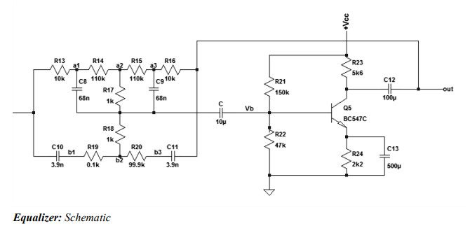

# High-Fidelity Audio Amplifier

## Project Overview

This project is a personal endeavor to design and build a **high-fidelity discrete audio amplifier**. Inspired by the principles taught in advanced electronic design courses, this amplifier showcases the application of **analog electronics** in creating high-quality audio reproduction systems. The project aims to achieve excellent audio performance while providing an opportunity for hands-on learning and experimentation with **discrete component designs**.

## Features

- **Discrete component** design for enhanced learning and customization
- High-fidelity audio reproduction with **low noise** and **low distortion**
- Three-stage design: **Pre-amplifier**, **Equalizer**, and **Power Amplifier**
- Custom-designed **power supply**
- **LTspice** simulations for circuit analysis and performance verification

## Technical Specifications

- **Total Harmonic Distortion (THD):** < 0.1%
- **Output Power:** 20W
- **Frequency Response:** 10 Hz - 100 kHz (-0.1dB)
- **Supply Voltage:** ±15V

## Circuit Description and Diagram

### Pre-amplifier
- Voltage amplification using a **compound pair** with **current source load**
- **Global negative feedback** for predictable gain
- **Volume control** via potentiometer
- **AC coupling** for improved DC biasing
  

### Equalizer
- **Baxandall tone control** circuit
- Independent **bass** and **treble** control
- Single active component implementation

### Power Amplifier
- Three-stage design: **input stage**, **voltage amplification stage**, and **output stage**
- Input stage: **Long-tailed differential pair** with current source load
- Voltage Amplification Stage (VAS): **Common emitter**
- Output Stage: **Class AB**

### Power Supply
- Custom-designed **20-0-20 transformer** with 3A current rating
- **Bridge rectifier** and capacitor filtering
- Regulated **±15V supply** for the equalizer circuit

## Simulation

This project utilizes **LTspice** for circuit simulation and waveform analysis. LTspice is a high-performance electronic circuit simulator, schematic capture, and waveform viewer, which was instrumental in verifying the design and performance of the amplifier circuits.

Key simulations performed include:
- **DC operating point** analysis
- **AC analysis** for frequency response
- **Transient analysis** for time-domain behavior
- **Distortion analysis**

For those new to LTspice, here's a helpful tutorial to get started:
[LTspice Tutorial for Beginners](https://www.youtube.com/watch?v=your_video_id_here)

---

**Note:** This project is a work in progress. Updates and improvements will be made regularly.
